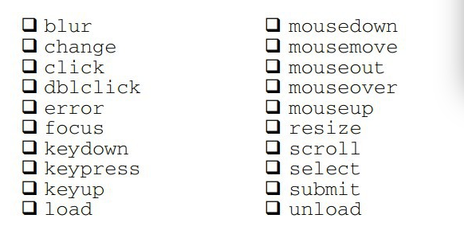

#JQuery 学习笔记

##选择器
使用$()选择JQuery对象，他的选择器与CSS的选择器十分的类似  
当然JQuery拥有一些自定义的选择符号

~~~
:eq(1)      //第几个元素
:odd    	//偶数的元素
:even       //基数的元素
:nth-child()    //这个选择符相对于元素的父元素而非当前选择的所有元素来计算位置，它可以接受数值、odd或even作为参数
:contains()     //这个区分大小
之后还有一系列基于表单的选择符

~~~
在选择后，其实选择的是一个数组，那么其实可以通过下面的方法获取

~~~
var myTag = $('#myTag')[0].tagName
var myTags = $('#myTag').get(0).tagName
~~~

##事件
~~~
$(document).ready()    //页面加载后调用
~~~
绑定事件使用bind()

~~~
$(document).ready(function() {
  $('#switcher-large').bind('click', function() {
    $('body').addClass('large');
  });
}); 
~~~
使用$(this)在function中 代表这个对象  
下面是一些事件  
  
下面再说一些事件流程

~~~
// 事件目标
// 未完成的代码
$(document).ready(function() {
  $('#switcher').click(function(event) {
    if (event.target == this) {
      $('#switcher button').toggleClass('hidden');
    }
  });
}); 

// 停止事件传播
$(document).ready(function() {
  $('#switcher').click(function(event) {
    $('#switcher button').toggleClass('hidden');
  });
});

$(document).ready(function() {
  $('#switcher-default').addClass('selected');

  $('#switcher button').click(function(event) {
    var bodyClass = this.id.split('-')[1];

    $('body').removeClass().addClass(bodyClass);

    $('#switcher button').removeClass('selected');
    $(this).addClass('selected');
    event.stopPropagation();
  });
}); 

// 判断this属性
$(document).ready(function() {
  $('#switcher').click(function(event) {
    if ($(event.target).is('button')) {  //使用 is 判断
      var bodyClass = event.target.id.split('-')[1];

      $('body').removeClass().addClass(bodyClass);

      $('#switcher button').removeClass('selected');
      $(event.target).addClass('selected');
      event.stopPropagation();
    }
  });
}); 

// 事件委托 ，有很多种方法 比如live,die等等
$('#switcher button').live('click', function() {
  var bodyClass = event.target.id.split('-')[1];

  $('body').removeClass().addClass(bodyClass);

  $('#switcher button').removeClass('selected');
  $(this).addClass('selected');
}); 

// 模仿用户
$(document).ready(function() {
  $('#switcher').trigger('click');
}); 

//从键盘输入
$(document).ready(function() {
  var triggers = {
    D: 'default',
    N: 'narrow',
    L: 'large'
  };

  $(document).keyup(function(event) {
    var key = String.fromCharCode(event.keyCode);
    if (key in triggers) {
      $('#switcher-' + triggers[key]).click();
    }
  });
}); 
~~~

##样式与动画
首先 .css() 这个方法 继承了getter和setter

~~~
// 单个属性及其值
.css('property', 'value')
// 属性-值对构成
.css({
  property1: 'value1',
  'property-2': 'value2'
}) 
~~~
使用hide和show现实和隐藏元素，其中还可以使用'slow'、'normal'和'fast'来当做速度的参数  
我们使用fadeIn和fadeOut实现淡出和淡入   
使用和slideDown和slideUp实现划上和滑下  
jquery还可以使用。animate()自定义动画，这里面有可以设置该标的元素，速度，回调等，是一个并发的方法，  
如果我们需要一个队列效果执行的动画呢，可以连缀多个animate()动画  
如果在速度选项中添加 queue:false，则不是使用队列触发

##DOM操作
我们可以使用addClass()和removeClass()来添加Class，对于其他的一些属性，我们则可以通过attr()和removeAttr()来添加和删除。  
使用attr赋值的时候其实可以不传值，传递一个function这样每次都会调用这个方法  
在jQuery可以使用.prop获取属性   

~~~
// 取得 "checked" 属性的当前值
var currentlyChecked = $('.my-checkbox').prop('checked');

// 设置 "checked" 属性的值
$('.my-checkbox').prop('checked', false); 
~~~
###添加，移动元素
(1) .insertBefore()在现有元素外部、之前添加内容；  
(2) .prependTo()在现有元素内部、之前添加内容；  
(3) .appendTo()在现有元素内部、之后添加内容；  
(4) .insertAfter()在现有元素外部、之后添加内容。  
与之对应的还有反向插入方法

~~~
$(document).ready(function() {
  $('<a href="#top">back to top</a>').insertAfter('div.chapterp');
  $('').prependTo('body');
}); 
~~~
移动元素和插入元素相似，只不过是选择已经存在的元素  

~~~
//包装元素
$(document).ready(function() {
  $('span.footnote')
    .insertBefore('#footer')
    .wrapAll('<ol id="notes"></ol>') //我们使用.wrapAll()把所有脚注都包含在一个<ol>中
    .wrap('<li></li>'); //使用.wrap()将每一个脚注分别包装在自己的<li>中
});

//复制
$('123').clone()
$('123').clone(true) //同时复制事件
~~~
###简单总结
对于jQuery提供的大量DOM操作方法，应该根据要完成的任务和元素的位置作出不同的选择。本章只介绍了一部分DOM操作方法，但其他方法的使用与这些方法类似；第12章还将更全面地讨论DOM操作方法。下面，我们简单地归纳出一些方法，这些方法几乎能够在任何情况下，完成任何任务。  
(1) 要在HTML中创建新元素，使用$()函数。  
(2) 要在每个匹配的元素中插入新元素，使用：  
append()  
appendTo()  
prepend()
prependTo()  
(3) 要在每个匹配的元素相邻的位置上插入新元素，使用：  
after()  
insertAfter()  
before()  
insertBefore()  
(4) 要在每个匹配的元素外部插入新元素，使用： 
wrap()  
wrapAll()  
wrapInner()  
(5) 要用新元素或文本替换每个匹配的元素，使用：  
html()  
text()  
replaceAll()  
replaceWith()  
(6) 要移除每个匹配的元素中的元素，使用：  
empty()  
(7) 要从文档中移除每个匹配的元素及其后代元素，但不实际删除它们，使用：  
remove()  
detach()  

##AJAX的使用
在下面的事件中返回false,防止跳转

~~~
//简单加载html
$(document).ready(function() {
  $('#letter-a a').click(function() {
    $('#dictionary').load('a.html');
    return false;
  });
}); 

//加载JSON
$(document).ready(function() {
  $('#letter-b a').click(function() {
    $.getJSON('b.json', function(data) {
      var html = '';
      $.each(data, function(entryIndex, entry) {
        html += '
';
        html += '<h3 class="term">' + entry.term + '</h3>';
        html += '
' + entry.part + '
';
        html += '
';
        html += entry.definition;
        html += '
';
        html += '
';
      });
      $('#dictionary').html(html);
    });
    return false;
  });
}); 

//加载JS
$(document).ready(function() {
  $('#letter-c a').click(function() {
    $.getScript('c.js');
    return false;
  });
}); 

//加载XML
$(document).ready(function() {
  $('#letter-d a').click(function() {
    $.get('d.xml', function(data) {
      $('#dictionary').empty();
      $(data).find('entry').each(function() {
        var $entry = $(this);
        var html = '
';
        html += '<h3 class="term">' + $entry.attr('term');
          html += '</h3>';
        html += '
' + $entry.attr('part');
          html += '
';
        html += '
';
        html += $entry.find('definition').text();
        var $quote = $entry.find('quote');
        if ($quote.length) {
          html += '
';
          $quote.find('line').each(function() {
            html += '
';
              html += $(this).text() + '
';
          });
          if ($quote.attr('author')) {
            html += '
';
              html += $quote.attr('author') + '
';
          }
          html += '
';
        }
        html += '
';
        html += '
';
        $('#dictionary').append($(html));
      });
    });
    return false;
  });
}); 

//使用get请求PHP
$(document).ready(function() {
  $('#letter-e a').click(function() {
    var requestData = {term: $(this).text()};
    $.get('e.php', requestData, function(data) {
      $('#dictionary').html(data);
    });
    return false;
  });
});

//使用POST请求
$(document).ready(function() {
  $('#letter-e a').click(function() {
    var requestData = {term: $(this).text()};
    $.post('e.php', requestData, function(data) {
      $('#dictionary').html(data);
    });
    return false;
  });
}); 
~~~
